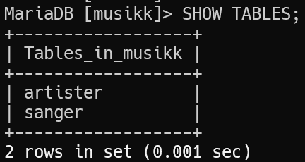
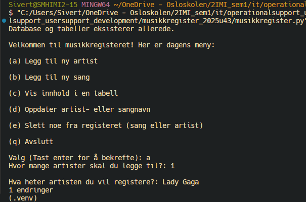
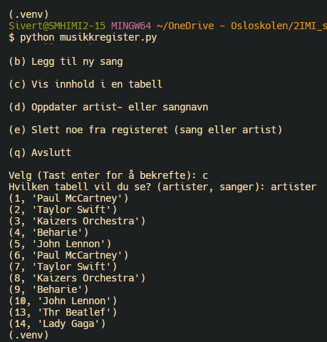
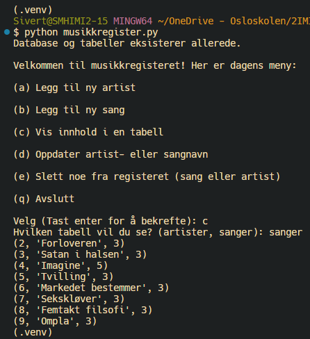
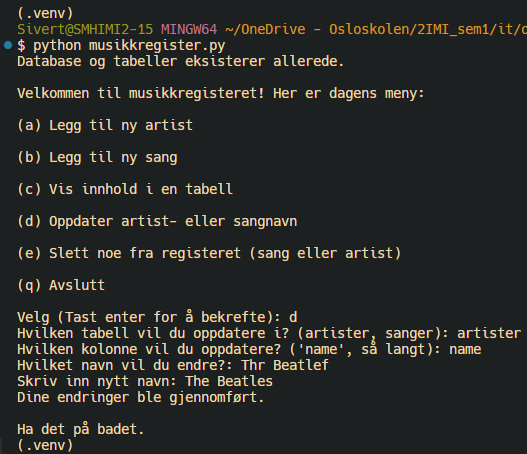
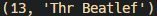
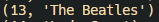

# Musikkregister Med Mysql og Python, Uke 43 2025

## Generelt Oppsett

- Lagde Viritual Environment

- Installerte pakker: ``pip install mysql-connector-python python-dotenv``

- Satt bind-adresse til 10.2.35.19, Pi-ens IP (DHCP), slik at bare IPer på LANet får logge inn

- Github: [https://github.com/sivertmh/musikkregister_2025u43](https://github.com/sivertmh/musikkregister_2025u43)

## Databasebruker

```
CREATE USER 'sett_inn_navn'@'10.3.124.125' IDENTIFIED BY 'sett_inn_passord';

GRANT ALL PRIVILEGES ON *.* TO 'sett_inn_navn'@'10.3.124.125';

FLUSH PRIVILEGES;
```

eller, hvis IP-adresse har endret seg p.g.a. DHCP:

``RENAME USER 'gammeltnavn'@'ip1' TO 'nyttnavn'@'ip2'``

- Erfaring: *.local funker ikke

## Struktur Av Database

``CREATE DATABASE musikk CHARACTER SET utf8mb4 COLLATE utf8mb4_unicode_ci;``

## Demo — Noen Skjermbilder

Jeg har en meny med mange funskjoner. Her er en demo av de forskjellige.

Visning av tabeller i musikkdatabasen:



* Legge til en ny artist til registeret/databasen:



* Lage en liste av artister som finnes i databasen med tilhørende id:



* Det samme som den over bare med sanger valgt:



* Oppdatering av artistnavn (funker også for sanger) med før- og etterbilde:





## Refleksjon

Dette prosjektet var interesant og enormt lærerikt. Jeg lærte mer om databaser og hvordan man kan kontrollere deres innhold ved bruk av Python-kode. Også lærte jeg hvordan gjøre denne prosessen litt mer brukvennlig for folk som ikke kan all kodingen. For å gjøre det lagde jeg en meny ved bruk av Pythons match-funskjon som lar brukeren velge handlinger som skal skje mot databasen ved å simpelthen svare på noen spørsmål. 

På én ukes tid fikk jeg gjort mesteparten av det som sto i oppgaven, men det er alltid noe som kan forbedres. Mer spesifikt, og på den estetiske siden, ville jeg lagd en enda mer brukervennlig meny som også ser finere ut. Her ville jeg hatt mer farger og skille mellom ting, slik at det som er viktig understrekes (metaforisk). Fra et funksjonellt perspektiv hadde jeg lagt til slik at du ikke må kunne noe utenat, at tabeller vises når du får spørsmål om hvilken artists id du skal skrive og lignende. Jeg rakk heller ikke legge til sletting, noe som kunne vært nytting med situasjonen jeg havnet i med duplikater.

PS: På starten lagde jeg tabeller og gjorde med uhell slik at de fem første ble duplisert, derfor har de etter høyere id. Jeg kan enkelt slette de, men prioriterte og rakk det ikke.
